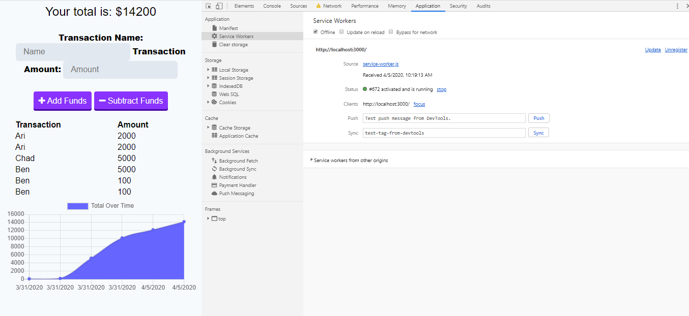
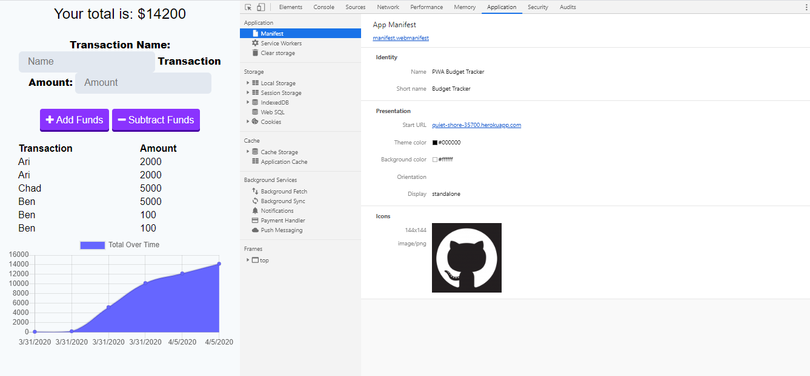

# PWA---Online-Offline-Budget-Tracker

- [User Story](#User-Story)
- [General Info](#General-Info)
- [Instructions](#Instructions)
- [Motivation](#Motivation)
- [Future Functionality](#Future-Functionality)
- [References](#References)

## User Story

AS AN avid traveller,
I WANT to be able to track my withdrawals and deposits with or without a data/internet connection,
SO THAT my account balance is accurate when I am traveling

## General-Info

Budget App that tracks funds with online and offline access. The frontend UI was completed beforehand, and my coding contribution was the backend files. This project employs a service worker and a webmanifest to ensure offline funcionality, caching, and the ability to install as a progressive web app. These performance properties were all discussed week 18 topics, and this budget tracker was a culmination of that knowledge.

## Instructions

To successfully run this application, the user should first clone the repository into a local file and run npm install. Using the local console, user will run "npm i" on the included dependencies. After, run "npm run start" and on your local browser, type in "localhost:3000." Alternatively, the deployed application can be visited at "https://quiet-shore-35700.herokuapp.com/." This will bring up the UI where funds can be added or subtracted. Going into the developer tools under Application, you can see "Manifest" and "Service Workers." Service worker allows the app to work offline.

while the Manifest gives the user the option to install the app as a PWA.

## Motivation

This was a great assignment to learn about caching, offline capabilities, and PWA's. My motivation was to understand these flexible options, especially the creation of a mobile app. Constructing the service worker and manifest helped me to understand the ideas behind these files which are important concepts moving forward.

## Future Functionality

Future functionality for this app includes applying more offline caching opportunities like caching Google Fonts or CSS. Using these would not only add more functionality to the service worker but increase the overall performance of the app.

## References

https://developers.google.com/web/tools/workbox
